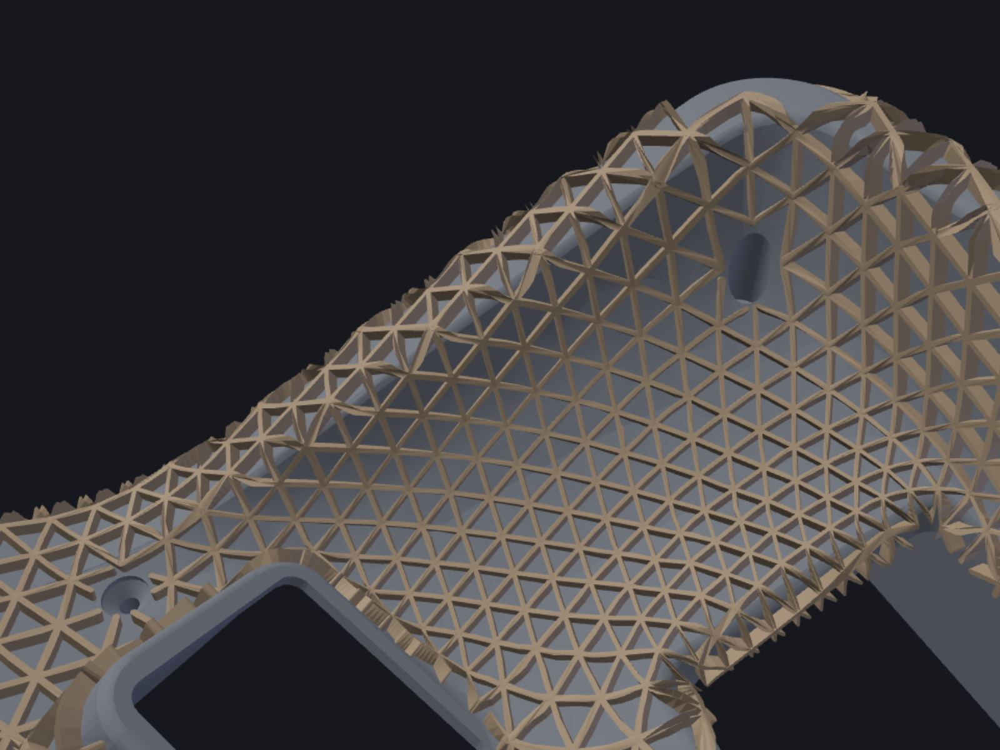

# RibbingTool

Local CAD tool for adding periodic rib patterns to STEP models — including
fully freeform curved faces. Open a `.step/.stp`, click faces in 3D (or grow a
whole tangent-connected skin from one click), pick a pattern and parameters,
apply, export STEP/STL. Built for 3D-printing stiffening/lightweighting.



## Setup (Windows, pip-only)

```bash
uv venv --python 3.13 .venv
uv pip install --python .venv -r requirements.txt
```

## Run

```bash
.venv\Scripts\python.exe -m uvicorn server.main:app --port 8317
```

Open http://localhost:8317 and load a STEP file.

## Workflow

1. **Load** a STEP file (file picker, or `POST /api/load_path {"path": ...}`).
2. **Select faces** — click to toggle. **Grow tangent** expands the selection
   across smoothly-connected faces (fillets, blended skins); faces with
   curvature radius under ~2.5 mm act as barriers so growth doesn't flood
   through rounded wall ends onto the far side of a shell.
3. **Pattern + parameters** — rectangular, quadmesh, triangular, isogrid,
   hexagonal, stochastic (seeded Voronoi); spacing, thickness, height,
   orientation, draft, boundary margin, optional border rib.
4. **Apply.** Connected selected faces are welded into one region and
   flattened together (LSCM), so the pattern flows continuously across face
   boundaries with a single coherent orientation.
5. **Export** STEP or STL. Undo steps back one apply.

## The two engines

| | fast (default on curved) | exact |
|---|---|---|
| Apply | instant-ish: ribs are exact B-rep solids kept as an overlay; no boolean | OCCT fuse into the body |
| Export STEP | faceted (triangulated) STEP via mesh union | smooth B-rep STEP |
| Export STL | mesh union (watertight) | tessellated fused body |
| Re-ribbing | fine — the body B-rep is never modified | fine |
| Scale | thousands of ribs on real parts | small jobs; planar faces |

`auto` uses exact when every selected face is planar, fast otherwise.

Why: OCCT mass-fuses of many rib solids against real curved bodies are
unreliable at scale — measured on the test part (142 ribs, 506-face body):
direct fuse crashes the process, chunked/OBB variants ran 26–69 minutes and
returned corrupted results. The fast engine sidesteps booleans at apply time
entirely and unions in mesh space (manifold3d) only at export, in seconds.
When the exact engine's fuse fails or produces a corrupt result, it
automatically falls back to the mesh path and marks the output faceted.

## How curved-face ribbing works

Per connected region of selected faces: weld the face triangulations along
OCCT's shared-edge node polygons → LSCM-flatten the region (seam-safe;
non-disk topology is cut open with `igl.cut_to_disk`) → generate the 2D
segment network → map each rib footprint back through barycentric → UV →
exact surface evaluation → build each rib as a solid between `surface − embed`
and `surface + height` along true surface normals (drafted top). Ribs whose
mapping shows folds, slit-jumps, or extreme conformal stretch are skipped and
counted in the per-region report.

## Known limits

- Conformal (LSCM) flattening preserves angles, not areas: on strongly curved
  or pinched regions the pattern spacing drifts, and ribs in extreme zones
  are skipped (reported). A curvature-aligned quad parametrization (nTop-style
  "quad mesh" flow) is out of scope for v1.
- Region borders can look ragged: clipped rib ends at the boundary, and
  mildly folded rib tops over tight concave transitions. Increasing the
  boundary margin and enabling the border rib cleans most of it.
- Fast-engine STEP output is faceted (fine for slicers; heavy for downstream
  CAD). Exact smooth STEP works best on planar faces or small curved jobs.
- Closed periodic faces (full cylinders) unroll at their CAD seam; the
  pattern does not join across the seam line.
- Single solid per file (assemblies: only the first solid is used).

## Tests

```bash
.venv\Scripts\python.exe -m pytest            # fast suite
.venv\Scripts\python.exe -m pytest -m slow    # cruscotto acceptance (minutes)
```

## Layout

- `server/geometry/` — step_io, meshing (+ region welding), flatten (LSCM +
  cuts), patterns (2D networks), ribbing (mapping + solids + fuse),
  booleans (OCCT + manifold3d), selection (grow tangent)
- `server/main.py` — FastAPI app
- `web/` — three.js viewer (face picking, overlay display), panel UI
- `testdata/` — cruscotto Part 1/2 test models
