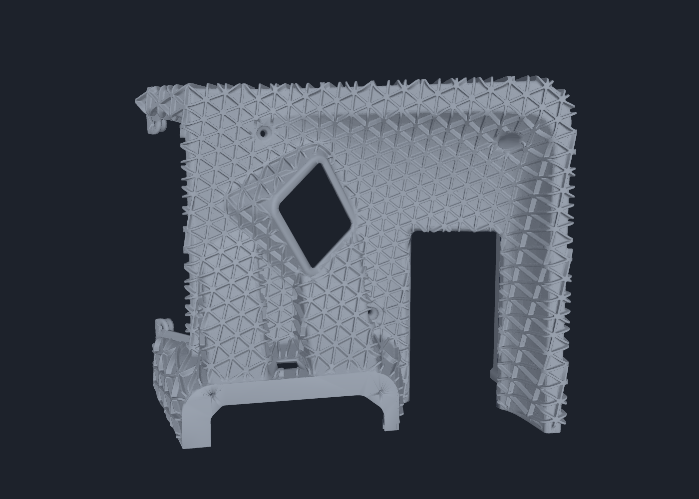
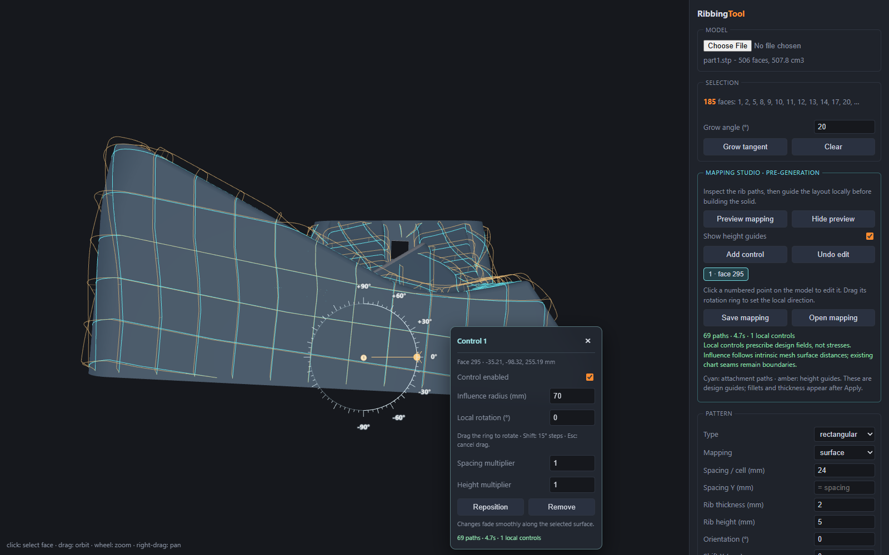

# RibbingTool

A local CAD tool for generating rib patterns on selected faces of STEP models.
Preview and edit the surface mapping, adjust rib dimensions and blending, then
export the result as STL or STEP. Built with Python, OpenCascade and Three.js.



## Features

- Select CAD faces directly in 3D and grow selections across tangent surfaces.
- Generate isogrid, triangular, rectangular, hexagonal and stochastic patterns.
- Preview the mapping before generation, with local controls for rotation,
  spacing and height.
- Adjust rib thickness, height, draft, boundary margin and root/junction blending.
- Recover supported incomplete CAD tessellations and validate STL closure.




Screenshots show our dashboard reference parts and the local mapping editor.

## Run locally

Python 3.13, tested on Windows:

```powershell
python -m venv .venv
.venv\Scripts\python.exe -m pip install -r requirements.txt
.venv\Scripts\python.exe -m uvicorn server.main:app --host 127.0.0.1 --port 8319
```

Open [localhost:8319](http://127.0.0.1:8319), load a STEP file, select faces,
preview the mapping and click **Apply ribs**.

## Status

Work in progress. Dense models can take significant time and memory; viewer
performance after Apply is being improved. Mapping controls are manually
prescribed design fields, not FEA or stress optimization. Surface-graph exports
are faceted geometry; mapping across difficult folds and seams still needs work.

## Development

```powershell
.venv\Scripts\python.exe -m pytest
.venv\Scripts\python.exe -m pytest -m slow
```

See [usage and geometry engines](docs/usage.md),
[mapping controls](docs/mapping-controls.md), and
[generation tests and benchmarks](docs/generation-performance.md).
